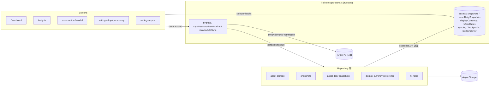

# Welcome to your Expo app 👋

This is an [Expo](https://expo.dev) project created with [`create-expo-app`](https://www.npmjs.com/package/create-expo-app).

## 资产与行情 — 唯一数据源说明（Assetup）

| 用途 | 位置 |
|------|------|
| **资产类型与字段** | `types/asset.ts`（`SimpleAsset`、`AssetCategory`） |
| **业务「今天」日期** | `lib/date-shanghai.ts`（上海时区 `YYYY-MM-DD`，与 UTC 的 `toISOString` 不同） |
| **东方财富公共参数** | `lib/eastmoney-config.ts` |
| **secid 构造 / QuoteID 推断** | `lib/eastmoney-secid.ts` |
| **添加资产表单校验与组装** | `lib/add-asset-form.ts` |
| **可选资产币种（非场内）** | `lib/asset-currency.ts` |

Dashboard 与 Tab 场景底色采用 **sea** 色板：`#B1D4F8` 雾蓝底、`#98CCF8` 天蓝、`#FAB8B4` 珊瑚、`#5C6390` 靛灰（主文案/强调）、`#B286B3` 灰紫；类别条与 `app/(tabs)/index.tsx` 中 `SEA` 常量一致。

- **`markPrice`**：push2 最新价（盘中）。**`lastClose`**：日 K 结算价。市值优先用 `markPrice`。
- **场外开放式基金**：联想里 `Classify=OTCFUND`，存 `exchange: 'OTC'`；`emSecid` 多为 `150.xxxxxx`。刷新估值时走 `lib/eastmoney-fund-nav.ts`（F10 `lsjz` 单位净值），因 push2 对基金常无有效现价。
- 旧的 `lib/asset-types.ts` 已删除，请勿再引用另一套 `Asset` 类型。

## 工程结构（简要）

| 路径 | 说明 |
|------|------|
| `app/` | Expo Router 页面与路由 |
| `components/` | 可复用 UI（含 `insights/*`、`add-asset/*`） |
| `lib/` | 业务逻辑；`lib/config/endpoints.ts` 集中外部 API 地址（可用 `EXPO_PUBLIC_*` 覆盖） |
| `lib/repositories/asset-repository.ts` | 资产读写薄封装，默认委托 `asset-storage` |
| `lib/errors/app-error.ts` | 统一错误与用户文案（可逐步接入） |
| `types/asset.ts` | 资产数据模型 |

## 数据层架构

App 内存态由 `lib/store/app-store.ts`（zustand）统一收口，5 个持久化键的写入通过 repository 内的 `subscribeXxx` 钩子自动回流到 store；屏幕只 `select`，不主动 `load`，跨 Tab 改动即时同步。

### 数据流



### 关键文件

| 路径 | 作用 |
| :- | :- |
| `lib/store/app-store.ts` | zustand store；持有 5 个数据 + `syncing/lastSyncAt/lastSyncError`；暴露 `hydrate / syncNetWorthFromMarket / maybeAutoSync` |
| `lib/store/selectors.ts` | 屏幕侧首选入口：`useAssets / useSnapshots / useAssetDailySnapshots / useDisplayCurrency / useFxUsdRates / useHydrated / useSyncing / useLastSyncAt / useLastSyncError` |
| `lib/store/auto-refresh.ts` | `startAutoRefresh()`：冷启动与 `AppState='active'` 切回前台时调 `maybeAutoSync`，`AUTO_REFRESH_THROTTLE_MS = 3 分钟` 节流，下拉手势调 `syncNetWorthFromMarket` 跳过节流 |
| `lib/store/mutex.ts` | 单 worker FIFO `persistMutex`，串行化所有持久化 mutation，避免并发写覆盖 |
| `lib/asset-storage.ts` 等 5 个 repository | 末尾通过 `subscribeXxx` 推送给 store；保留原同步 API 以服务 lib helper / 表单页的 read-modify-write |

### 屏幕侧使用规则

| 场景 | 推荐写法 |
| :- | :- |
| 展示型 Tab / 设置页（dashboard / insights / settings-display-currency / settings-fx / settings-export / settings-attribution） | `useAssets()` / `useSnapshots()` / `useDisplayCurrency()` 等 selector，删除 `useFocusEffect → reload` |
| 提交资产 / 流水 / 调价的表单（asset-action / modal / cash-ledger-edit / trade-edit） | 写前用 `getAssets()` 拿最新值 → `saveAssets / updateAsset` → 必要时调 `useAppStore.getState().syncNetWorthFromMarket()` 触发净值刷新 |
| 仅消费独立 storage 的页（market / settings-archived / settings-trash / fxHistory 卡片） | 保留本地 `useState` + `useFocusEffect`，不入 store |

### 自动刷新节流

`startAutoRefresh()` 在 `app/_layout.tsx` 的 hydrate 完成后挂载：

- 冷启动 hydrate 完成 → `maybeAutoSync()`（节流允许时执行一次）。
- 后台切回前台（`AppState=active`）→ `maybeAutoSync()`。
- 距上次 `lastSyncAt < 3 分钟`：跳过；距上次 ≥ 3 分钟：触发 `syncNetWorthFromMarket()`。
- 失败仅写入 `lastSyncError`，不弹 Alert / 不阻塞 UI；UI 可读 `useLastSyncError()` 自行展示。
- 用户主动下拉刷新走 `useAppStore.getState().syncNetWorthFromMarket()`，**不**经过节流。

### 写入串行化

所有"会落到 AsyncStorage"的远端同步走 `persistMutex.run(...)`（当前由 `syncNetWorthFromMarket` 包裹），避免与用户手动 `updateAsset` 并发写 `assets` key 时互相覆盖。后续若新增其他后台合并/迁移写入，需主动包裹一次 mutex。

### Hydrate Gate

`app/_layout.tsx` 在 `hydrate()` 返回前渲染全屏 `ActivityIndicator`，避免 Tab 屏幕短暂闪空数据；旧 storage key 的一次性迁移 (`migrateAssetupStorageFromLegacyOnce` / `purgeLegacyTestSnapshotDatesOnce`) **必须**先于 `hydrate` 执行。

## 备份与换机（本地数据迁移）

数据全部存在本机 `AsyncStorage`，不上云、不走账号。为避免换机丢数据，提供「完整备份 (.zip) + 导入恢复」流程。

入口：**设置 → 数据 → 导出数据 / 导入备份**。

### 导出 (.zip)

文件名 `assetup-backup-YYYYMMDD-HHmm.zip`，明文（未加密）。结构：

```
backup.json           # 换机恢复的唯一数据源；含 schemaVersion、integrity(sha256)
README.txt            # 字段字典与恢复步骤
transactions.csv      # 全期间手动流水，仅供 Excel 审阅
daily-networth.csv    # 每日总净值 + 折算 CNY
daily-assets.csv      # 每日逐资产市值
```

`backup.json` 顶层字段（参考 [`lib/backup-bundle.ts`](lib/backup-bundle.ts) 中的 `BackupPayload`）：

| 字段 | 内容 |
|---|---|
| `assets` | `SimpleAsset[]`，含 `history` / `tradeHistory` / `cashLedger` |
| `snapshots` | 每日总净值 `{date, totalValue, totalValueCny?, fxRateDate?}` |
| `assetDailySnapshots` | 每日逐资产市值（最长 730 天） |
| `archived` / `trash` | 归档与最近删除的资产快照 |
| `integrity` | 对本文件去掉该字段后的稳定 JSON 的 sha256；导入时自动校验 |

### 导入恢复

在新设备上选择备份文件后，先展示「概览卡」（导出时间、资产数、流水数、日期范围、完整性校验）。两种策略：

- **覆盖恢复（推荐）**：四个本地键全部替换为备份里的内容，适合换机。
- **合并导入**：按 `asset.id` 合并资产（同 id 以备份为准），按日期合并 snapshots / daily，按 recordId 合并归档/回收站，资产内部 `tradeHistory` / `cashLedger` 按条目 id 去重。

写入前会把当前数据打成一份 `assetup-pre-import-*.zip` 存到应用缓存目录，执行失败自动回放；成功后也保留该文件，在结果页点「回滚到导入前」可一键恢复。

> 明文备份包含全部资产与流水，请不要上传到公开云盘或第三方位置。

## 脚本

```bash
npm install
npm run lint      # ESLint（Expo）
npm run test      # Vitest（纯函数单测）
npx expo start    # 开发服务
```

## Get started

1. Install dependencies

   ```bash
   npm install
   ```

2. Start the app

   ```bash
   npx expo start
   ```

In the output, you'll find options to open the app in a

- [development build](https://docs.expo.dev/develop/development-builds/introduction/)
- [Android emulator](https://docs.expo.dev/workflow/android-studio-emulator/)
- [iOS simulator](https://docs.expo.dev/workflow/ios-simulator/)
- [Expo Go](https://expo.dev/go), a limited sandbox for trying out app development with Expo

You can start developing by editing the files inside the **app** directory. This project uses [file-based routing](https://docs.expo.dev/router/introduction).

## Get a fresh project

When you're ready, run:

```bash
npm run reset-project
```

This command will move the starter code to the **app-example** directory and create a blank **app** directory where you can start developing.

## Learn more

To learn more about developing your project with Expo, look at the following resources:

- [Expo documentation](https://docs.expo.dev/): Learn fundamentals, or go into advanced topics with our [guides](https://docs.expo.dev/guides).
- [Learn Expo tutorial](https://docs.expo.dev/tutorial/introduction/): Follow a step-by-step tutorial where you'll create a project that runs on Android, iOS, and the web.

## Join the community

Join our community of developers creating universal apps.

- [Expo on GitHub](https://github.com/expo/expo): View our open source platform and contribute.
- [Discord community](https://chat.expo.dev): Chat with Expo users and ask questions.
